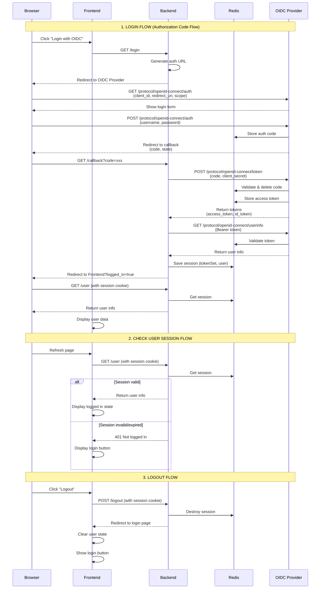

# MỤC TIÊU DỰ ÁN: MULTI-SSO COMPARISON STACK

## Mục Tiêu Khởi Chạy

Mục tiêu cuối cùng là khởi động toàn bộ hệ thống phát triển cục bộ một cách đơn giản nhất:

```bash
docker-compose up -d
```

Lệnh này sẽ triển khai thành công:

- **3 Ứng Dụng Độc Lập** (Backend & Frontend riêng biệt).
- **3 Nhà Cung Cấp SSO Độc Lập** (để so sánh và phân tích).
- Toàn bộ dự án sử dụng chung **PostgreSQL DB** và **Redis Cache** để quản lý dữ liệu và phiên.

---

## 🎯 Mục Đích Chính

Thiết lập này nhằm mục đích **giảm sát, phân tích và so sánh** hiệu suất, luồng xác thực của 3 nhà cung cấp SSO khác nhau trong một môi trường thống nhất.

---

## 🤝 Quy Tắc Cộng Tác (Chỉnh Sửa Code)

Để đảm bảo tính ổn định và tránh xung đột, vui lòng tuân thủ nghiêm ngặt các quy tắc sau:

### 1. **File** `docker-compose.yml`:
   - **Đường dẫn**: Chỉ chính sửa các khối service có **NOTE TÊN CỦA BẠN** bên cạnh.
   - **Cấm**: **TUYỆT ĐỐI KHÔNG** thay đổi các service chung: `postgres-db`, `redis-cache`, và cấu hình mạng (network).

### 2. **Thư mục** `apps/`:
   - Chỉ chỉnh sửa trong thư mục ứng dụng mà bạn được giao (ví dụ: `apps/app-oc/`).

### 3. **Thư mục** `sso-providers/`:
   - Chỉ chỉnh sửa trong thư mục nhà cung cấp SSO mà bạn phụ trách.

**NGUYÊN TẮC**: Không dùng tới phần code hoặc cấu hình của người khác.
**OIDC Diagram**
